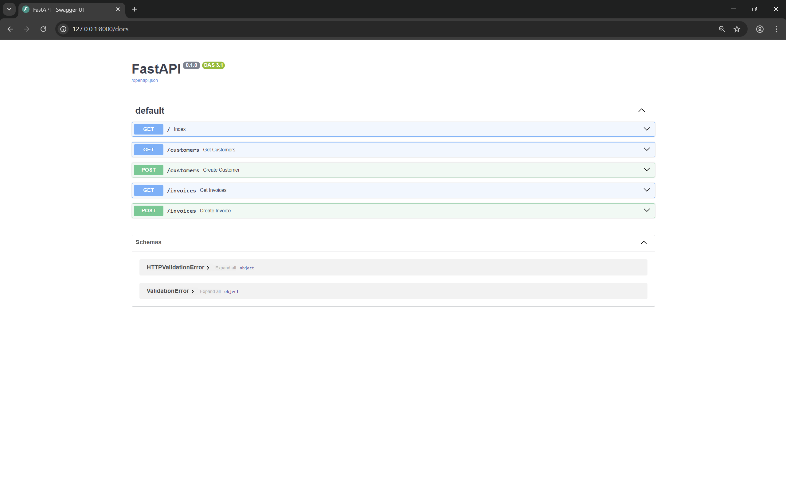
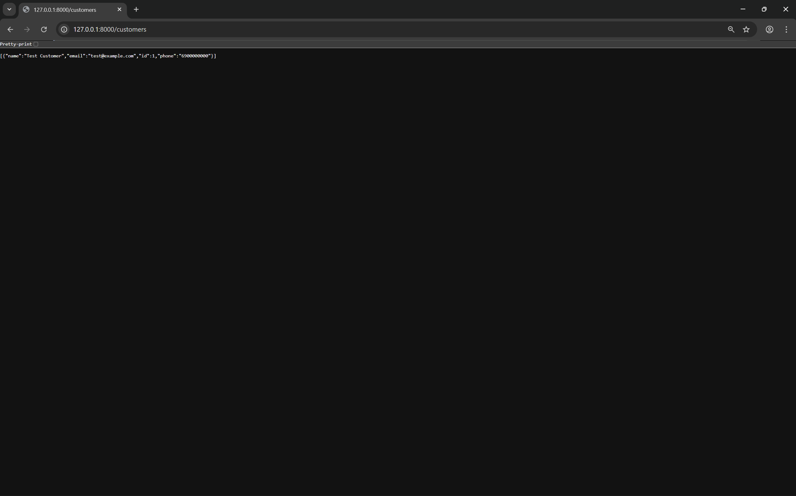
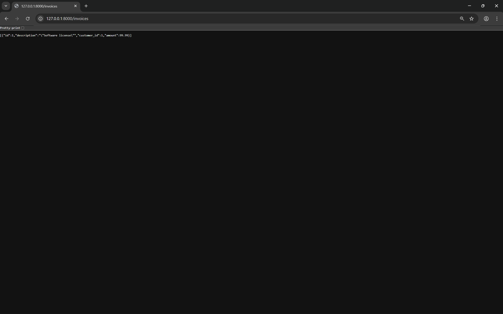

# Business CRM System

CRM/ERP-style web application for managing customers and invoices, built with FastAPI and SQLite.


## Screenshots

### API Documentation (Swagger UI)


### Customers List (JSON)


### Invoices List (JSON)


## Features

- CRUD operations for customers and invoices
- REST API with automatic interactive documentation (`/docs`)
- Database migrations with Alembic
- SQLite database (can be switched to PostgreSQL)
- Virtual environment support

## Installation

```bash
git clone https://github.com/romanp217/business-crm.git
cd business-crm
python3 -m venv venv
source venv/bin/activate
pip install -r requirements.txt
alembic upgrade head
uvicorn app.main:app --reload
```

## API Endpoints

| Method | Endpoint     | Description          |
|--------|--------------|----------------------|
| GET    | /customers   | List all customers   |
| POST   | /customers   | Create a customer    |
| GET    | /invoices    | List all invoices    |
| POST   | /invoices    | Create an invoice    |

Interactive documentation available at `/docs`.

## Project Structure

```
business-crm/
├── app/
│   ├── main.py
│   ├── models/
│   │   ├── database.py
│   │   ├── customer.py
│   │   └── invoice.py
│   └── routers/
│       ├── customers.py
│       └── invoices.py
├── alembic/
│   └── versions/
├── screenshots/
├── requirements.txt
├── alembic.ini
└── README.md
```

## License

MIT
